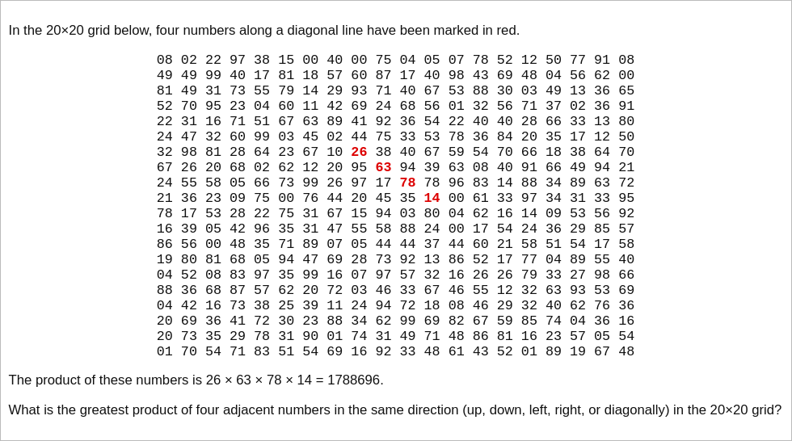

# [Project Euler Problem 11](https://projecteuler.net/problem=11)

## 问题

**Largest Product in a Grid**



## 答案

`70600674`

## 解法

直接写程序求解穷举所有的可能。

算法部分的 Python 代码如下，完整的代码见 [solution_11.py](../solutions/solution_11.py)。

```python
def solve_p11(matrix: list[list[int]], n: int) -> int:
    """Solver for problem 11."""
    max_prod = 0
    rows = len(matrix)
    cols = len(matrix[0])
    for r in range(0, rows):
        for c in range(0, cols):
            # column
            if r + 4 <= rows:
                prod = matrix[r][c] * matrix[r+1][c] * matrix[r+2][c] * matrix[r+3][c]
                max_prod = max(max_prod, prod)
            # row
            if c + 4 <= cols:
                prod = matrix[r][c] * matrix[r][c+1] * matrix[r][c+2] * matrix[r][c+3]
                max_prod = max(max_prod, prod)
            # diagonal
            if r + 4 <= rows and c + 4 <= cols:
                prod = matrix[r][c] * matrix[r+1][c+1] * matrix[r+2][c+2] * matrix[r+3][c+3]
                max_prod = max(max_prod, prod)
            # secondary diagonal
            if r + 4 <= rows and c >= 4:
                prod = matrix[r][c] * matrix[r+1][c-1] * matrix[r+2][c-2] * matrix[r+3][c-3]
                max_prod = max(max_prod, prod)
    return max_prod
```

事实上，乘积最大的四个数是次对角线上的 `89*94*97*87=70600674`。
