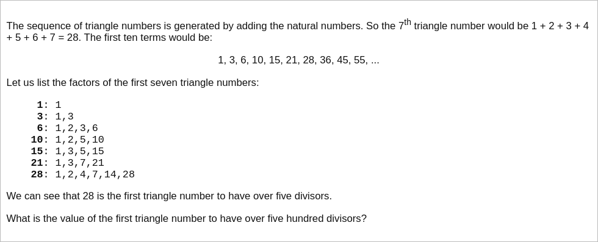

# [Project Euler Problem 12](https://projecteuler.net/problem=12)

## 问题

**Highly Divisible Triangular Number**



## 答案

`76576500`

## 解法

直接写程序暴力求解，从小到大枚举三角形数(Triangular Number)，直到某一个三角形数的因子数超过 500 。

算法部分的 Python 代码如下，完整的代码见 [solution_12.py](../solutions/solution_12.py)。

```python
from sympy import divisor_count


def solve_p12(k: int) -> int:
    """Solver for problem 12."""
    i = 1
    while True:
        n = i * (i + 1) // 2
        if divisor_count(n) > k:
            return n
        i += 1
```
