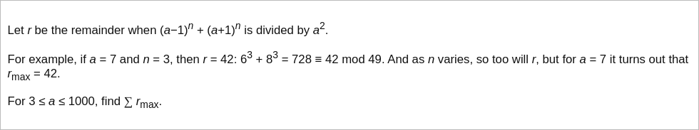

# [Project Euler Problem 120](https://projecteuler.net/problem=120)

## 问题

**Square remainders**



## 答案

`333082500`

## 解法

二项式展开 `pow(a-1,n) + pow(a+1,n)` 后，模除 `(a*a)` 不为 0 的项是：

- 当 `n` 是奇数时，`r = (2*a*n) % (a*a)` 。
- 当 `n` 是偶数时，`r = 2 % (a*a)` 。

根据以上分析，我们可以写程序让奇数 `n` 从 1 开始循环到某个上限 `u` ，记录最大的 `r` 。
这个上限只需要取 `u=2a+1` 即可，因为 `(2*a*(2a+1))%(a*a) = (2*a)%(a*a)` ，即当 `n=2a+1` 时，其余数和 `n=1` 的余数相同。

算法部分的 Python 代码如下，完整的代码见 [solution_120.py](../solutions/solution_120.py)。

```python
def calc_r_max(a: int) -> int:
    r_max = 2
    for n in range(1, a*2+2, 2):
        r = (2 * n * a) % (a * a)
        r_max = max(r_max, r)
    return r_max


def solve_p120():
    result = 0
    for a in range(3, 1001):
        result += calc_r_max(a)
    return result
```
