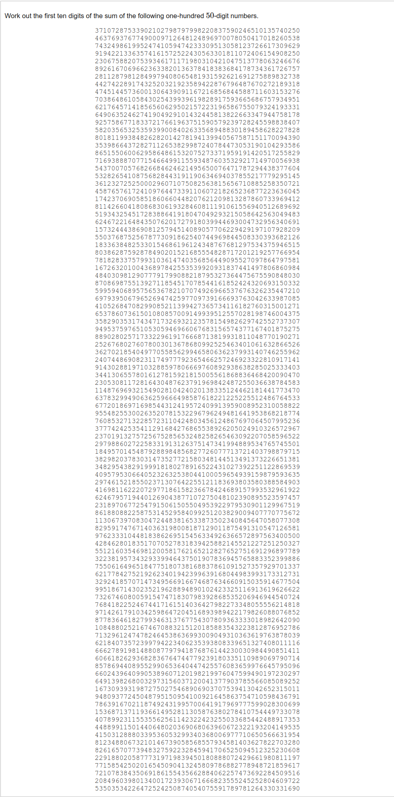

# [Project Euler Problem 13](https://projecteuler.net/problem=13)

## 问题

**Large Sum**



## 答案

`5537376230`

## 解法

利用 Python 支持大整数的特性，直接写程序求解。
算法部分的 Python 代码如下，完整的代码见 [solution_13.py](../solutions/solution_13.py)。

```python
def solve_p13(arr: list[int]) -> int:
    return int(str(sum(arr))[0:10])
```
