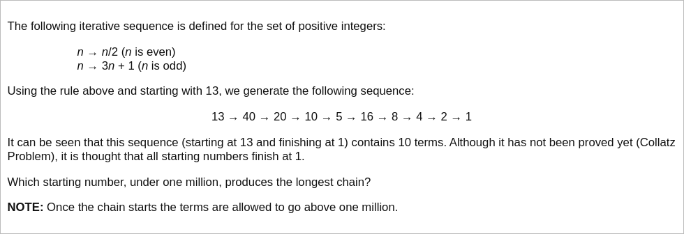

# [Project Euler Problem 14](https://projecteuler.net/problem=14)

## 问题

**Longest Collatz Sequence**



## 答案

`837799`

## 解法

直接写程序暴力循环所有数字是可行的，只是时间上会比较久。
一个优化方案是动态规划，用一个映射 `dp` 存下已经计算过的数值的 Collatz 序列的长度。
一旦在计算过程中出现已经计算过的数值，那么当前串上的所有数值的长度就都已经知道了。

算法部分的 Python 代码如下，完整的代码见 [solution_14.py](../solutions/solution_14.py)。

```python
def solve_p14(max_n: int) -> int:
    # Dict dp[k] stores the chain length given number k.
    dp = {1: 1}
    for i in range(1, max_n):
        curr = []
        k = i
        while k not in dp:
            curr.append(k)
            if k % 2 == 0:
                k //= 2
            else:
                k = 3 * k + 1
        # Current chain length.
        r = dp[k]
        while len(curr) > 0:
            r += 1
            dp[curr.pop()] = r
    # Get the number with max chain length.
    return max(dp, key=dp.get)
```
