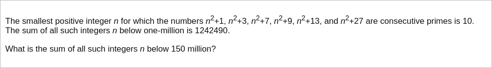

# [Project Euler Problem 146](https://projecteuler.net/problem=146)

## 问题

**Investigating a Prime Pattern**



## 答案

`676333270`

## 分析

考虑`n^2`的个位数，平方数的个位数只可能是`0,1,4,5,6,9`。

- 对于个位数是`1,5,9`来说，`n^2+1`是偶数，不是质数。
- 对于个位数是`4`来说，`n^2+1`的个位数是`5`，能被`5`整除，不是质数。
- 对于个位数是`6`来说，`n^2+9`的个位数是`5`，能被`5`整除，不是质数。

从上面的推导可以得出，`n^2`的个位数只可能是`0`，从而`n`的个位数只能是`0`。

另一方面，显然`n`不能被`3,7,13`整除。

## 解法

根据以上分析，写程序穷举所有的`n`，然后用快速质数判断算法来验证。
算法部分的 Python 代码如下，完整的代码见 [solution_146.py](../solutions/solution_146.py)。

```python
from sympy import isprime


def is_valid(sq: int) -> bool:
    prime_diffs = [1, 3, 7, 9, 13, 27]
    composite_diffs = [11, 17, 19, 21, 23]
    for d in prime_diffs:
        if not isprime(sq + d):
            return False
    for d in composite_diffs:
        if isprime(sq + d):
            return False
    return True


def solve_p146(upper_bound: int) -> int:
    result = 0
    for k in range(1, upper_bound // 10 + 1):
        if k % 3 == 0 or k % 7 == 0 or k % 13 == 0:
            continue
        sq = k * k * 100
        if is_valid(sq):
            result += k * 10
    return result
```
