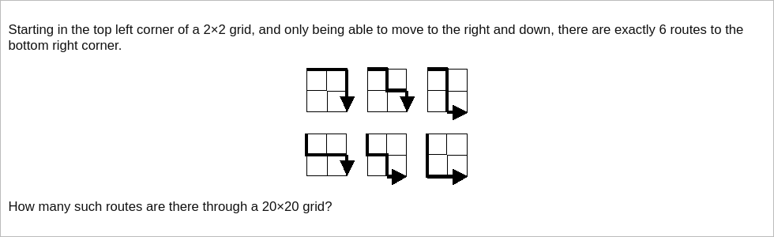

# [Project Euler Problem 15](https://projecteuler.net/problem=15)

## 问题

**Lattice Paths**



## 答案

`137846528820`

## 解法

这道题可以用动态规划来做，不过更简单的是数学方法。
标准的二项分布组合数问题，对 `m * n` 的矩阵来说，从左上到右下的路线数是 `C(m+n,n)=C(m+n,m)`。

算法部分的 Python 代码如下，这里直接调用 `sympy` 包的相关函数求解。
完整的代码见 [solution_15.py](../solutions/solution_15.py)。

```python
from sympy import binomial


def solve_p15(m: int, n: int) -> int:
    return binomial(m + n, n)
```
