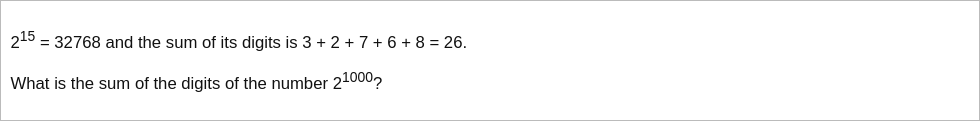

# [Project Euler Problem 16](https://projecteuler.net/problem=16)

## 问题

**Power digit sum**



## 答案

`1366`

## 解法 1

在支持大整数的编程语言中可以直接求解，算法部分的 Python 代码如下，完整的代码见 [solution_16.py](../solutions/solution_16.py)。

```python
def solve_p16(n: int) -> int:
    result = 0
    while n > 0:
        result += n % 10
        n //= 10
    return result
```
