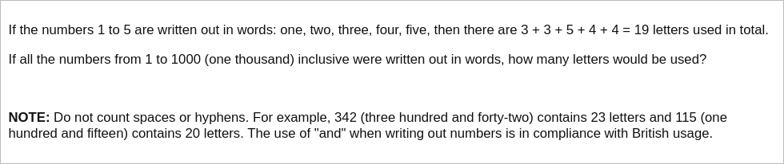

# [Project Euler Problem 17](https://projecteuler.net/problem=17)

## 问题

**Number Letter Counts**



## 答案

`21124`

## 解法

直接写程序求解。算法部分的 Python 代码如下，完整的代码见 [solution_17.py](../solutions/solution_17.py)。

```python
def num2english(num_dict: dict, n: int):
    """Convert given number to the English description."""
    if n == 1000:
        return 'one thousand'
    if 1 <= n <= 19:
        return num_dict[n]
    if 20 <= n <= 99:
        return num_dict[n] if n in num_dict else num_dict[
            n // 10 * 10] + ' ' + num_dict[n % 10]
    if n % 100 == 0:
        return num_dict[n // 100] + ' hundred'
    return num_dict[n // 100] + ' hundred and ' + num2english(num_dict, n % 100)


def solve_p17(n: int) -> int:
    num_dict = {
        1: 'one',
        2: 'two',
        3: 'three',
        4: 'four',
        5: 'five',
        6: 'six',
        7: 'seven',
        8: 'eight',
        9: 'nine',
        10: 'ten',
        11: 'eleven',
        12: 'twelve',
        13: 'thirteen',
        14: 'fourteen',
        15: 'fifteen',
        16: 'sixteen',
        17: 'seventeen',
        18: 'eighteen',
        19: 'nineteen',
        20: 'twenty',
        30: 'thirty',
        40: 'forty',
        50: 'fifty',
        60: 'sixty',
        70: 'seventy',
        80: 'eighty',
        90: 'ninety',
    }

    return sum(
        len(num2english(num_dict, x).replace(' ', '')) for x in range(1, n + 1))
```
