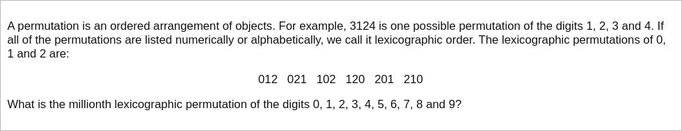

# [Project Euler Problem 24](https://projecteuler.net/problem=24)

## 问题

**Lexicographic permutations**



## 答案

`2783915460`

## 暴力解法

因为所有排列的总数只有`10!=3628800`个，直接写程序按照字典序得到所有排列，然后取第一百万个。
算法部分的 Python 代码如下，这里调用了`itertools.permutations`得到排列序列。
完整的代码见 [solution_24.py](../solutions/solution_24.py)。

```python
import itertools


def solve_p24_naive(n: int) -> int:
    l = list(itertools.permutations(list(range(0, 10))))[n - 1]
    return int(''.join(str(x) for x in l))
```

## 数学解法

首先考虑首位数字。确定首位后，剩余`9`个数字的排列有`9! = 362880`种。
因此以`0`为首位数字的排列的排位是`1 ~ 9!`位，以`1`为首位数字的排列的排位是`9!+1 ~ 2*9!`，
以`2`为首位数字的排列的排位是`2*9!+1 ~ 3*9!`，即`725761 ~ 1088640`。
这个范围包括了`1000000`，所以最终结果的首位一定是`2`。

继续考虑第二位数字。确定前两位后，剩余`8`个数字的排列有`8! = 40320`种。
因此以`20`为前两位的排列的排位是`2*9!+1 ~ 2*9!+8!`，
以`21`为前两位的排列的排位是`2*9!+8!+1 ~ 2*9!+2*8!`，
注意没有以`22`为前两位的排列，
以`23`为前两位的排列的排位是`2*9!+2*8!+1 ~ 2*9!+3*8!`，
以此类推，以`27`为前两位的排列的排位是`2*9!+6*8!+1 ~ 2*9!+7*8!`，即`967681 ~ 1008000`。
这个范围包括了`1000000`，所以最终结果前两位一定是`27`。

以此类推，可以计算出最终排列的后面每一位，结果是`2783915460`。

上述算法也可以写成程序，算法部分的 Python 代码如下，
完整的代码见 [solution_24.py](../solutions/solution_24.py)。

```python
def solve_p24(n: int) -> int:
    result = 0
    rest = n - 1
    # Number of permutations: 0!, 1!, ..., 9!
    perm = [1, 1, 2, 6, 24, 120, 720, 5040, 40320, 362880]
    digits = list(range(0, 10))
    for i in range(1, 11):
        t = rest // perm[10 - i]
        rest %= perm[10 - i]
        result *= 10
        result += digits[t]
        del digits[t]
    return result
```
