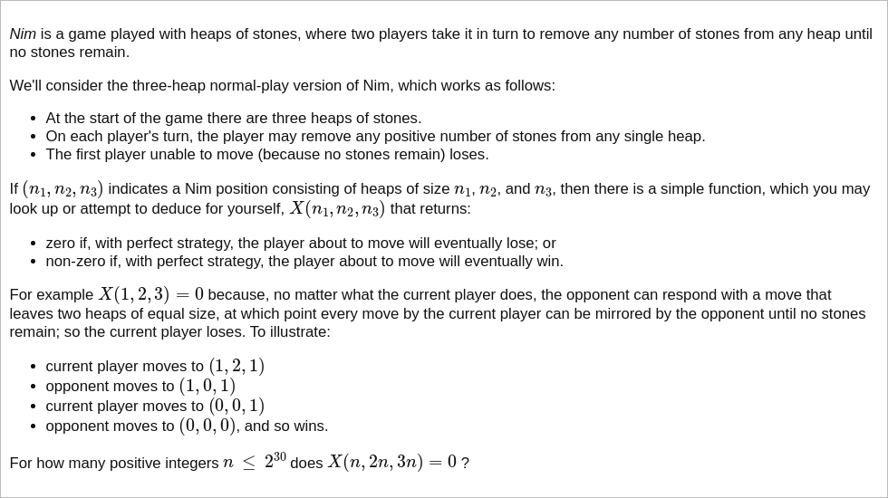

# [Project Euler Problem 301](https://projecteuler.net/problem=301)

## 问题

**Nim**



## 答案

`2178309`

## 解法

尼姆(Nim)游戏的解法函数，也就是题目给出的`X(n_1,n_2,n_3)`函数是二进制异或。

直接写程序暴力求解，算法部分的 Python 代码如下，完整的代码见 [solution_301.py](../solutions/solution_301.py)。

```python
def solve_p301(n: int) -> int:
    result = 0
    for x in range(1, n + 1):
        if x ^ (2 * x) ^ (3 * x) == 0:
            result += 1
    return result
```
