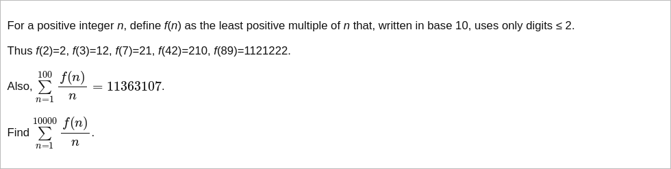

# [Project Euler Problem 303](https://projecteuler.net/problem=303)

## 问题

**Multiples with small digits**



## 答案

`1111981904675169`

## 朴素解法

计算函数`f(n)`时，从小到大穷举所有只包含`0,1,2`的数字，然后依次判断是否是给定整数`n`的倍数，返回最小的符合条件的数字。
这个朴素解法可以在较短时间内解决除了`n=9999`之外的数字的问题，但对于数字`n=9999`的情况，需要搜索的空间太大不可行。

注意观察`f(n)`的值，会发现比较大的几个数值对应的值是：`f(9)=12222,f(99)=1122222222,f(999)=111222222222222`。
根据规律，我们可以猜测`f(9999)=11112222222222222222`。

算法部分的 Python 代码如下，完整的代码见 [solution_303.py](../solutions/solution_303.py)。

```python
import math


def calc_f_naive(n: int) -> int:
    # Check for 9999...
    d = round(math.log10(n + 1))
    if pow(10, d) == n + 1:
        return int('1' * d + '2222' * d)
    # Enumerate all numbers with digits in {0,1,2}.
    dp = [0]
    b = 1
    while True:
        ndp = list(dp)
        for d in range(1, 3):
            for k in dp:
                v = d * b + k
                if v > 0 and v % n == 0:
                    return v
                ndp.append(v)
        b = b * 10
        dp, ndp = ndp, dp


def solve_p303_naive(n: int) -> int:
    result = 0
    for i in range(1, n + 1):
        f = calc_f_naive(i)
        assert f % i == 0
        result += f // i
    return result
```

## 改进解法

朴素解法的问题是在计算长度为`d`的候选的时候，先前计算过的较短的数字必须存下来，这会导致使用的内存过大。

因为最后需要验证的是候选数字能否整除`n`，无需记录较短的数字，而只需要对每一个模除`n`的余数记住第一次出现的数字即可。
这样存储空间从`O(3^d)`缩减到`O(n)`。

改进后算法部分的 Python 代码如下，完整的代码见 [solution_303.py](../solutions/solution_303.py)。

```python
def calc_f(n: int) -> int:
    dp = dict()  # map reminder to smaller number
    b = 1
    dp[0] = 0
    while True:
        for k in dp:
            assert dp[k] % n == k
        ndp = dict(dp)
        for d in range(1, 3):
            for k in dp:
                v = d * b + dp[k]
                if v > 0 and v % n == 0:
                    return v
                if v % n not in ndp:
                    ndp[v % n] = d * b + dp[k]
        b = b * 10
        dp, ndp = ndp, dp


def solve_p303(n: int) -> int:
    result = 0
    for i in range(1, n + 1):
        f = calc_f(i)
        assert f % i == 0
        result += f // i
    return result
```
