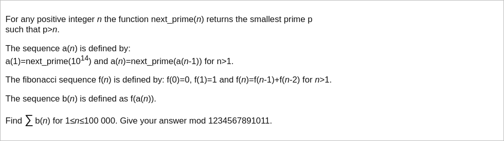
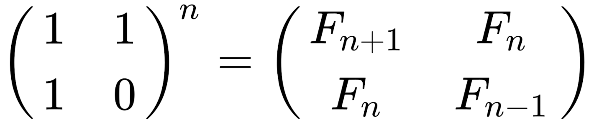

# [Project Euler Problem 304](https://projecteuler.net/problem=304)

## 问题

**Primonacci**



## 答案

`283988410192`

## 解法

这道题似乎没有什么巧妙方法可以转换问题，直接写程序求解。

对于`a(n)`序列来说，因为数值比较大，不太适合预先分配空间进行用筛法。
这里直接调用 Python 中 `sympy.nextprime` 来循环得到所有的`a(n)`。

对于斐波那契数列(Fibonacci sequence)来说，矩阵形式是：



因为斐波那契数列迭代过程中只用到加法和乘法运算，因此矩阵运算可以稍作修改变成模除的矩阵乘法。
这里参考的代码来自[维基百科](https://en.wikipedia.org/wiki/Modular_exponentiation#Matrices)。

算法部分的 Python 代码如下，完整的代码见 [solution_304.py](../solutions/solution_304.py)。

```python
from sympy import nextprime


def matrix_multiply_mod(a: list[int], b: list[int], mod: int) -> list[int]:
    """ Return a*b in the matrix form.

    :param a: the input 2x2 matrix represent as [a00,a01,a10,a11].
    :param b: the input 2x2 matrix represent as [b00,b01,b10,b11].
    :param mod: the modulo.
    :return: the multiplication modulo operation for matrices.
    """
    return [(a[0] * b[0] + a[1] * b[2]) % mod,
            (a[0] * b[1] + a[1] * b[3]) % mod,
            (a[2] * b[0] + a[3] * b[2]) % mod,
            (a[2] * b[1] + a[3] * b[3]) % mod]


def matrix_pow_mod(a: list[int], b: int, mod: int) -> list[int]:
    """ Return a^b % mod in the matrix form.

    :param a: the input 2x2 matrix represent as [a00,a01,a10,a11].
    :param b: the power.
    :param mod: the modulo.
    :return: the pow modulo operation for matrices.
    """
    if b == 0:
        # The identity matrix.
        return [1, 0, 0, 1]
    if b % 2 != 0:
        sub = matrix_pow_mod(a, b - 1, mod)
        return matrix_multiply_mod(a, sub, mod)
    sub = matrix_pow_mod(a, b // 2, mod)
    return matrix_multiply_mod(sub, sub, mod)


def fibonacci_mod(n: int, mod: int) -> int:
    """ Return the n-th Fibonacci number f(n)%mod.

    :param n: the index in the Fibonacci sequence.
    :param mod: the modulo.
    :return: Return the n-th Fibonacci number f(n)%mod.
    """
    matrix = matrix_pow_mod([1, 1, 1, 0], n, mod)
    return matrix[1]


def solve_p304(n: int) -> int:
    mod = 1234567891011
    result = 0
    a = nextprime(pow(10, 14))
    for i in range(n):
        result = (result + fibonacci_mod(a, mod)) % mod
        a = nextprime(a)
    return result
```
