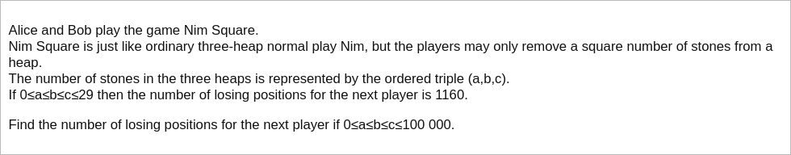

# [Project Euler Problem 310](https://projecteuler.net/problem=310)

## 问题

**Nim Square**



## 答案

`2586528661783`

## 分析

根据[Sprague-Grundy定理](https://en.wikipedia.org/wiki/Sprague%E2%80%93Grundy_theorem)，
任何无偏的组合游戏都等价于一个尼姆(Nim)游戏。
记题目的给出的平方尼姆游戏有`n`个石子的状态为`#n`，而共有`n`个石子的普通尼姆游戏为`*n`。
解题思路是首先把平方尼姆游戏转换成普通尼姆游戏，再根据普通尼姆游戏的胜负判别规则来计算胜利条件。

把任意无偏游戏转换成普通尼姆游戏的一般方法是，求出移动一步后的所有状态对应的普通尼姆值，
再运用Mex(Minimum EXcluded value)规则找到缺少的最小元素。
举例说明：

- `#0`：没有石子，显然对应了普通尼姆游戏的`*0`，即`#0=*0`。
- `#1`：只可能拿掉`1`个石子，得到状态集合是`{#0}={*0}`，缺少的最小元素是`*1`，因此`#1=*1`。
- `#2`：只可能拿掉`1`个石子，得到状态集合是`{#1}={*1}`，缺少的最小元素是`*0`，因此`#2=*0`。
- `#3`：只可能拿掉`1`个石子，得到状态集合是`{#2}={*0}`，缺少的最小元素是`*1`，因此`#3=*1`。
- `#4`：只可能拿掉`1`个或`4`个石子，得到状态集合是`{#0,#3}={*0,*1}`，缺少的最小元素是`*2`，因此`#4=*2`。
- `#5`：只可能拿掉`1`个或`4`个石子，得到状态集合是`{#1,#4}={*1,*2}`，缺少的最小元素是`*0`，因此`#5=*0`。
- `#6`：只可能拿掉`1`个或`4`个石子，得到状态集合是`{#2,#5}={*0}`，缺少的最小元素是`*1`，因此`#6=*1`。
- `#7`：只可能拿掉`1`个或`4`个石子，得到状态集合是`{#3,#6}={*1}`，缺少的最小元素是`*0`，因此`#7=*0`。
- `#8`：只可能拿掉`1`个或`4`个石子，得到状态集合是`{#4,#7}={*0,*2}`，缺少的最小元素是`*1`，因此`#8=*1`。
- `#9`：只可能拿掉`1`个或`4`个或`9`个石子，得到状态集合是`{#0,#5,#8}={*0,*1}`，缺少的最小元素是`*2`，因此`#9=*2`。
- `#10`：只可能拿掉`1`个或`4`个或`9`个石子，得到状态集合是`{#1,#6,#9}={*1,*2}`，缺少的最小元素是`*0`，因此`#10=*0`。

多堆普通尼姆加和的规则是取异或。当异或值为`*0`时，先取石子的玩家必败。

如果直接穷举`a,b`的值，虽然也可以得到结果，但实际运行时间比较长，但可以优化一下。
一种方法是统计不同普通尼姆值出现的次数，循环`a`，然后对`b,c`仅循环普通尼姆的次数映射，可以大大加速运行速度。

## 解法

基于以上分析，写程序求解，算法部分的 Python 代码如下，完整的代码见 [solution_310.py](../solutions/solution_310.py)。

```python
def get_all_squares(n: int) -> list[int]:
    """ Return all positive square numbers that are less than or equal to n.

    :param n: the upper bound (inclusive).
    :return: all square numbers that are less than or equal to n.
    """
    result = list()
    k = 1
    while k * k <= n:
        result.append(k * k)
        k += 1
    return result


def map_square_nim(n: int) -> list[int]:
    """ Map square nim #k to basic nim *k for all 0<=k<=n.

    :param n: the length of square nim heap.
    :return: the list of mapped the length of basic nim heap.
    """
    squares = get_all_squares(n)
    result = [0]
    for k in range(1, n + 1):
        # Calculate sub nim set.
        sub_nim_set = set()
        for sq in squares:
            if sq > k:
                break
            sub_nim_set.add(result[k - sq])
        # Find minimum excluded value in sub nim set.
        for mex in range(k + 1):
            if mex not in sub_nim_set:
                result.append(mex)
                break
    return result


def solve_p310(n: int) -> int:
    nim_values = map_square_nim(n)
    # Get the count of mapped basic nim values.
    nim_counts = dict()
    for nim in nim_values:
        nim_counts[nim] = nim_counts.get(nim, 0) + 1
    # Loop and count.
    result = 0
    for a in range(n + 1):
        # Calculate zero count of given `a`, which corresponds to the count of `a<=b=c<=n`.
        zero_count = (n + 1 - a) if nim_values[a] == 0 else 0
        # Calculate current count of given `a`, and `a<=b<=n,a<=c<=n`.
        curr_count = 0
        for b_nim, b_cnt in nim_counts.items():
            x = nim_values[a] ^ b_nim
            curr_count += b_cnt * nim_counts.get(x, 0)
        # Adjust current count from condition `a<=b<=n,a<=c<=n` to `a<=b<=c<=n`.
        assert (curr_count + zero_count) % 2 == 0
        result += (curr_count + zero_count) // 2
        # Remove mapped basic nim of a from nim counts for the next round.
        nim_counts[nim_values[a]] -= 1
    return result
```
