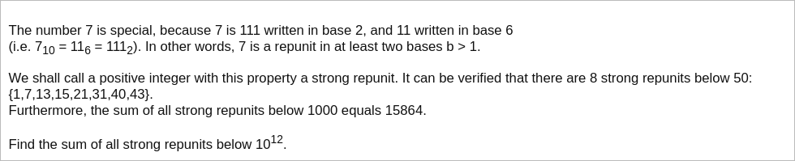

# [Project Euler Problem 346](https://projecteuler.net/problem=346)

## 问题

**Strong Repunits**



## 答案

`336108797689259276`

## 解法

显然对于任何一个正整数`n`来说，都可以写成`(n-1)`进制的`11`，所以只需要找到另一个`b!=n-1`即可。

假设`n`可以写成`b`进制下的`1...1`共`k`个，那么有：`n=b^0+b^1+...b^(k-1)`。
利用等比数列公式可知`n=(1-b^k)/(1-b)`。

写程序穷举所有的`b`和`k`并加和。
算法部分的 Python 代码如下，完整的代码见 [solution_346.py](../solutions/solution_346.py)。

```python
def calc_rep_unit(b: int, k: int) -> int:
    assert (pow(b,k)-1)%(b-1) == 0
    return (pow(b, k) - 1) // (b - 1)


def solve_p346(n: int) -> int:
    rep_units = set()
    rep_units.add(1)
    early_exit = False
    for b in range(2, n):
        k = 3
        while True:
            m = calc_rep_unit(b, k)
            if m >= n:
                if k == 3:
                    early_exit = True
                break
            rep_units.add(m)
            k += 1
        if early_exit:
            break
    return sum(rep_units)
```
