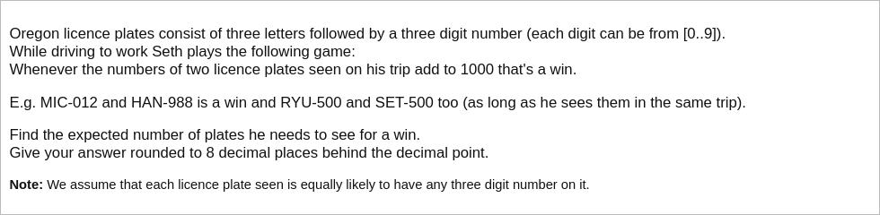

# [Project Euler Problem 371](https://projecteuler.net/problem=371)

## 问题

**Licence plates**



## 答案

`40.66368097`

## 分析

我们考虑一般性的问题：从非负整数集合`{0,1,...,N-1}`中可重复地反复取数，当两个数字加起来等于某个偶数`N`时达到胜利条件。
对这个问题，有如下观察：

1. 每新增一个数字是否胜利只与之前遇到的多少种不同的数字相关，与具体某个数字遇到多少次无关。
2. `0`比较特殊，因为是否看到它不影响之后的胜利条件。
3. `N/2`比较特殊，因为相同的两个数字相加就可以胜利，而其他相加胜利的两个个数字必定是不同的。

基于以上几点，定义系统的状态为`(k,b)`，其中`k`为遇到过的非`0`和`N/2`的不同数字个数，`b=true/false`表示是否遇到过`N/2`数字。
简记状态为 `kb`，例如`5t`表示之前遇到过`N/2`，而且还有`5`种其他非`0`也非`N/2`的不同数字。
另外，胜利的状态我们用一个特殊的符号`w`表示。

- 初始状态为`0f`，即没有出现任何数字。
- 胜利状态为`w`，从其转移到其他状态的概率都为`0`。
- 当状态为`kf`时，可以转移到的状态有：
  - `kf`，即转到自身，如果遇到数字`0`或已经出现过的数字，概率为`(k+1)/N`。
  - `kt`，如果遇到数字`N/2`，概率为`1/N`。
  - `w`，如果遇到没有出现过的新数字(非`0`和`N/2`)与某一个已经遇到的数字相加和为`N`，概率为`k/N`。
  - `(k+1)f`，如果遇到没有出现过的新数字(非`0`和`N/2`)且不能与已经遇到的数字相加和为`N`，概率为`(N-2k-2)/N`。
- 当状态为`kt`时，可以转移到的状态有：
  - `kt`，即转到自身，如果遇到数字`0`或已经出现过的数字，概率为`(k+1)/N`。
  - `w`，如果遇到的数字`N/2`，概率为`1/N`。
  - `w`，如果遇到没有出现过的新数字(非`0`和`N/2`)与某一个已经遇到的数字(非`0`和`N/2`)相加和为`N`，概率为`k/N`。
  - `(k+1)t`，如果遇到没有出现过的新数字(非`0`和`N/2`)且不能与已经遇到的数字相加和为`N`，概率为`(N-2k-2)/N`。

可能的状态集合是有限的，因为根据鸽笼原理，`k`的值不能超过`N/2-1`。
所有的状态可以写成一个`N+1`维的列向量`S=[w,0f,1f,...,(N/2-1)f,0t,1t,2t,...,(N/2-1)t]`。

令第`k`轮各个状态出现的概率记为`P_k=[p(S_1),p(S_2),p(S_(N+1))]`，
遇到一个新数字后状态转移后对应的概率记为`P_(k+1)=[p'(S_1),p'(S_2),...,p'(S_(N+1))]`。
如果我们把每一步转移的概率写成矩阵`M`，使得`M(i,j)=P(S_i|S_j)`，
那么根据联合概率和条件概率的定义，每一步的转移之后的状态概率变化可以写成：`P_(k+1)=M * P_k`。
初始的状态是`0f`，因此对应的概率向量是`P_0=[0,1,0,...,0]`。

举例说明，我们考虑`N=6`，出现的数字集合是`{0,1,...,5}`，状态向量是`[w,0f,1f,2f,0t,1t,2t]` 那么转移矩阵`M`如下所示：

| M=     | **w** | **0f** | **1f** | **2f** | **0t** | **1t** | **2t** |
|--------|-------|--------|--------|--------|--------|--------|--------|
| **w**  | 0     | 0      | 1/6    | 2/6    | 1/6    | 2/6    | 3/6    |
| **0f** | 0     | 1/6    | 0      | 0      | 0      | 0      | 0      |
| **1f** | 0     | 4/6    | 2/6    | 0      | 0      | 0      | 0      |
| **2f** | 0     | 0      | 2/6    | 3/6    | 0      | 0      | 0      |
| **0t** | 0     | 1/6    | 0      | 0      | 1/6    | 0      | 0      |
| **1t** | 0     | 0      | 1/6    | 0      | 4/6    | 2/6    | 0      |
| **2t** | 0     | 0      | 0      | 1/6    | 0      | 2/6    | 3/6    |

显然除了从`w`转出的概率全部为`0`外，其他列的概率之和应该为`1`。

题目要求的期望每一轮状态为`w`的概率乘以轮数加和，每一轮`w`出现的概率可以用`M`反复乘以初始的状态概率向量得到。
换句话说，第`k`轮状态的概率向量可以写成`P_k=M^k * P_0`，其中`M^k`表示方阵`M`的`k`次方。

因为`N=1000`比较小，直接计算方阵的幂是可以接受的。
如果直接计算这个乘积比较耗时，我们可以对矩阵`M`进行奇异值分解(Singular Value Decomposition, SVD)，写成`M=U*S*V'`，
其中`U`和`V`是单位正交矩阵，`S`是对角矩阵包含矩阵的奇异值(非负特征值的平方)，`V'`表示矩阵转置。
通过这个分解，由线性代数的相关知识可知：`M^k=U * S^k * V'`，即只需要计算特征值的幂再乘回去即可。

以上矩阵表示在数学上比较漂亮，也是下面给出的代码所使用的方法。
如果不用矩阵，一般的动态规划迭代实现也可以达到相同的目标。

## 解法

根据i以上分析， 我们写程序求解。
算法部分的 Python 代码如下，完整的代码见 [solution_371.py](../solutions/solution_371.py)。

```python
import numpy as np


def build_status_vector_map(n: int) -> dict:
    """ Build status vector map, which maps status string to matrix index.

    :param n: the given number, must be even.
    :return: the map from status string to matrix index.
    """
    idx_map = dict()
    idx_map['w'] = 0
    for k in range(0, n // 2):
        idx_map['{}f'.format(k)] = len(idx_map)
    for k in range(0, n // 2):
        idx_map['{}t'.format(k)] = len(idx_map)
    return idx_map


def build_transfer_matrix(n: int, idx_map: dict) -> np.ndarray:
    """ Build probability transfer matrix such that: M(i,j)=p(i|j).

    :param n: the given number, must be even.
    :param idx_map: the map from status string to matrix index.
    :return: the probability transfer matrix.
    """
    matrix = np.zeros((n + 1, n + 1))
    for k in range(0, n // 2):
        from_idx = idx_map.get('{}f'.format(k))
        # From `kf` to `kf`.
        to_idx = idx_map.get('{}f'.format(k))
        matrix[to_idx, from_idx] = (k + 1) / n
        # From `kf` to `kt`.
        to_idx = idx_map.get('{}t'.format(k))
        matrix[to_idx, from_idx] = 1 / n
        # From `kf` to `w`.
        to_idx = idx_map.get('w')
        matrix[to_idx, from_idx] = k / n
        # From `kf` to `(k+1)f`.
        if k + 1 < n // 2:
            to_idx = idx_map.get('{}f'.format(k + 1))
            matrix[to_idx, from_idx] = (n - 2 * k - 2) / n
    for k in range(0, n // 2):
        from_idx = idx_map.get('{}t'.format(k))
        # From `kt` to `kt`.
        to_idx = idx_map.get('{}t'.format(k))
        matrix[to_idx, from_idx] = (k + 1) / n
        # From `kt` to `w`
        to_idx = idx_map.get('w')
        matrix[to_idx, from_idx] = (k + 1) / n
        # From `kt` to `(k+1)t`.
        if k + 1 < n // 2:
            to_idx = idx_map.get('{}t'.format(k + 1))
            matrix[to_idx, from_idx] = (n - 2 * k - 2) / n
    return matrix


def solve_p371(n: int) -> float:
    # Build status vector map, which maps status string to matrix index.
    idx_map = build_status_vector_map(n)
    # Build transfer matrix.
    matrix = build_transfer_matrix(n, idx_map)
    # Probability vector
    probs = np.zeros((n + 1))
    probs[1] = 1.0
    # Multiple matrix to vector.
    c = 0
    result = 0.0
    while True:
        c += 1
        probs = matrix.dot(probs)
        win_prob = probs[0]
        inc = c * win_prob
        result += inc
        if c >= 2 and inc < 1e-10:
            break
    return result
```
