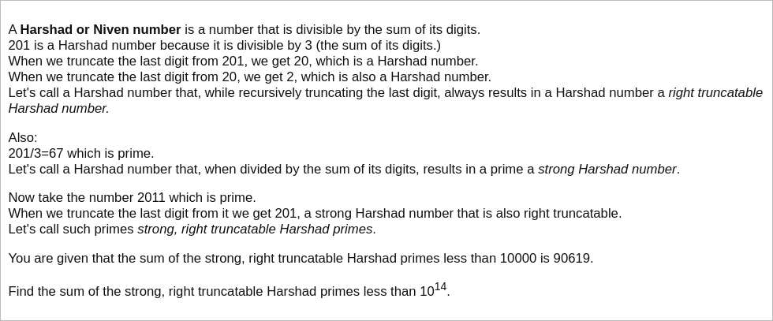

# [Project Euler Problem 387](https://projecteuler.net/problem=387)

## 问题

**Harshad Numbers**



## 答案

`696067597313468`

## 解法

直接写程序暴力搜索。

因为右侧可截的 Harshad 数(right truncatable Harshad numbers)具有递归性质，
我们从个位数(显然`1`到`9`满足定义)开始，递归添加末位数字，然后验证即可。

算法部分的 Python 代码如下，完整的代码见 [solution_387.py](../solutions/solution_387.py)。

```python
from sympy import isprime


def calc(num: int, digits_sum: int, max_num: int) -> int:
    result = 0
    if num >= max_num:
        return result
    # Check right truncatable Harshad numbers.
    if num % digits_sum != 0:
        return result
    # Check strong right truncatable Harshad numbers.
    if isprime(num // digits_sum):
        for last in [1,3,7,9]:
            next_num = num * 10 + last
            # Check strong, right truncatable Harshad primes.
            if next_num < max_num and isprime(next_num):
                result += next_num
    # Extend right truncatable Harshad numbers.
    for last in range(10):
        result += calc(num * 10 + last, digits_sum + last, max_num)
    return result


def solve_p387(max_num: int) -> int:
    result = 0
    for seed in range(1, 10):
        result += calc(seed, seed, max_num)
    return result
```
