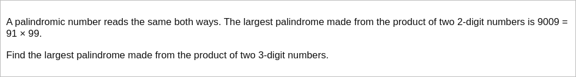

# [Project Euler Problem 4](https://projecteuler.net/problem=4)

## 问题

**Largest palindrome product**



## 答案

`906609`

## 解法

直接写程序暴力搜索所有的两个三位数的乘积可以得到结果。

一个小的优化。两个三位数`x,y`的乘积记为`n=x*y`，可能是五位数也可能是六位数，因为题目求最大，所以我们假设`n`是六位数。
因为`n`是回文数(palindrome)，所以`n`的数字串可以写成`abccba`的形式，其中`a,b,c`都是一位数，且`a>0`。
那么，有`n=a+b*10+c*100+c*1000+b*10000*a*100000=11*(a*9091+b*910+c*100)`，
也就是说`x,y`两个数至少有一个是`11`的倍数，我们可以利用这一点来加速暴力搜索。

算法部分的 Python 代码如下，完整的代码见 [solution_4.py](../solutions/solution_4.py)。

```python
def is_palindrome(n: int):
    s = str(n)
    return s == s[::-1]


def solve_p4_naive() -> int:
    max_palindrome = 0
    for x in range(999, 99, -1):
        # Break early.
        if x * (x - 1) <= max_palindrome:
            break
        for y in range(x - 1, 99, -1):
            n = x * y
            # Break early.
            if n <= max_palindrome:
                break
            # Update max.
            if is_palindrome(n):
                max_palindrome = n
    return max_palindrome


def solve_p4() -> int:
    # n = a_b_c_c_b_a = 11 * (9091 * a + 910 * b + 100 * c)
    # n = x * y, so x or y must be multipliers of 11
    max_palindrome = 0
    for x in range(999, 99, -1):
        # Break early.
        if x * (x - 1) <= max_palindrome:
            break
        if x % 11 == 0:
            y_start = x - 1
            y_step = -1
        else:
            y_start = x - (x % 11)
            y_step = -11
        for y in range(y_start, 99, y_step):
            n = x * y
            # Break early.
            if n <= max_palindrome:
                break
            # Update max.
            if is_palindrome(n):
                max_palindrome = n
    return max_palindrome
```

答案是`906609`，事实上`906609=993*913`。
