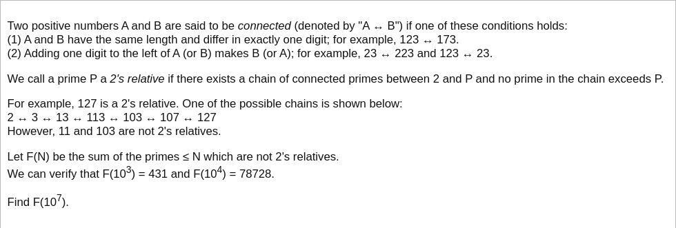

# [Project Euler Problem 425](https://projecteuler.net/problem=425)

## 问题

**Prime connection**



## 答案

`46479497324`

## 解法

这道题明显就是图搜索问题。
每一个质数就是图的一个结点，而连接关系(connected)是图的无向边。

搜索的时候需要注意，题目要求路径上的点不能超过最终的结点大小。
例如 `2 -> 3 -> 13 -> 11` 不是一条有效路径，因为路径经过了 `13`，大于目标质数 `11`。
因此，我们可以修改广度优先搜索(Breadth-first search)算法，使用一个排序集合(而不是先入先出的队列)来表示搜索队列，每次扩展队列中最小元素。
在把某个结点加入到访问过的结点集合中时，记住搜索到这个结点路径上最大的元素。
这样可以保证这个记录下的元素是所有可能到达某个结点路径上必须经过的最大元素的最小值。

算法部分的 Python 代码如下，完整的代码见 [solution_425.py](../solutions/solution_425.py)。

```python
from sortedcontainers import SortedSet
from sympy import sieve


def get_relatives(prime: int):
    prime_str = str(prime)
    # Replace one character.
    for i in range(len(prime_str)):
        for d in range(0 if i > 0 else 1, 10):
            t = prime_str[:i] + str(d) + prime_str[i + 1:]
            if t != prime_str:
                yield int(t)
    # Add one character to the left.
    for d in range(1, 10):
        yield int(str(d) + prime_str)
    # Delete first character.
    if len(prime_str) > 1:
        yield int(prime_str[1:])


def solve_p425(n: int) -> int:
    primes = set(sieve.primerange(2, n + 1))
    # Sorted BFS queue, so each time the minimal element in the queue is expanded.
    q = SortedSet()
    q.add(2)
    # Visited dictionary, mapping the element to the maximal value in the path.
    relatives = dict()
    relatives[2] = 1
    while len(q) > 0:
        curr = q[0]
        q.remove(curr)
        for t in get_relatives(curr):
            # Already visited.
            if t in relatives:
                continue
            if t in primes:
                # Choose the max.
                relatives[t] = max(curr, relatives[curr])
                # Add to the queue.
                q.add(t)
    # Sum up.
    result = 0
    for prime in primes:
        if prime not in relatives or relatives[prime] > prime:
            result += prime
    return result
```
