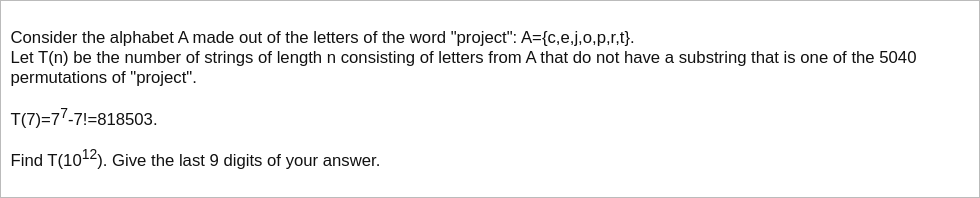

# [Project Euler Problem 458](https://projecteuler.net/problem=458)

## 问题

**Permutations of Project**



## 答案

`423341841`

## 解法

可以写程序用动态规划方法求解。
令`dp(n,k)`为长度为`n`且末尾最长`k`个字符完全不同的可能串的个数。
因为题目要求不能出现连续`7`个不同的字符，因此`k`的取值范围是`1<=k<=min(n,6)`。

假设`dp(n,k)`已经计算完毕，考虑第`n+1`位：

- 如果第`n+1`位取第`n`位的字符，只有一种取法，转移到状态`dp(n+1,1)`。
- 如果第`n+1`位取第`n-1`位的字符，只有一种取法，转移到状态`dp(n+1,2)`。
- ...
- 如果第`n+1`位取第`n-k+1`位字符，只有一种取法，转移到状态`dp(n+1,k)`。
- 如果第`n+1`位取其他字符，有`(7-k)`种取法，转移到状态`dp(n+1,k+1)`。

写出递推公式：

```text
dp(n+1,1)=dp(n,1)+dp(n,2)+dp(n,3)+dp(n,4)+dp(n,5)+dp(n,6)
dp(n+1,2)=6*dp(n,1)+dp(n,2)+dp(n,3)+dp(n,4)+dp(n,5)+dp(n,6)
dp(n+1,3)=5*dp(n,2)+dp(n,3)+dp(n,4)+dp(n,5)+dp(n,6)
dp(n+1,4)=4*dp(n,3)+dp(n,4)+dp(n,5)+dp(n,6)
dp(n+1,5)=3*dp(n,4)+dp(n,5)+dp(n,6)
dp(n+1,6)=2*dp(n,5)+dp(n,6)
```

令`x(n)=[dp(n,1),dp(n,2),dp(n,3),dp(n,4),dp(n,5),dp(n,6)]`，递推公式可以写成矩阵形式：`x(n+1)=T * x(n)`。
其中转移矩阵`T`是：

```text
1,1,1,1,1,1
6,1,1,1,1,1
0,5,1,1,1,1
0,0,4,1,1,1
0,0,0,3,1,1
0,0,0,0,2,1
```

初始条件是：`x(1)=[7,0,0,0,0,0]`。
最终结果是：`x(10^12)=T^{10^12-1} * x(1)`。
其中矩阵乘方模除有快速算法，参考[维基百科](https://en.wikipedia.org/wiki/Modular_exponentiation#Matrices)。

算法部分的 Python 代码如下，完整的代码见 [solution_458.py](../solutions/solution_458.py)。

```python
import numpy as np


def solve_p458(n: int) -> int:
    mod = pow(10, 9)
    mat = np.matrix(
        [[1, 1, 1, 1, 1, 1],
         [6, 1, 1, 1, 1, 1],
         [0, 5, 1, 1, 1, 1],
         [0, 0, 4, 1, 1, 1],
         [0, 0, 0, 3, 1, 1],
         [0, 0, 0, 0, 2, 1]], dtype=int)
    x = np.matrix([7, 0, 0, 0, 0, 0], dtype=int).transpose()
    result = sum(matrix_pow_mod(mat, n - 1, mod) * x) % mod
    return result.item((0, 0))
```
