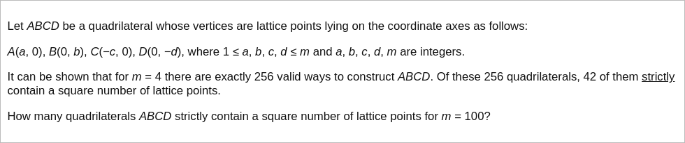

# [Project Euler Problem 504](https://projecteuler.net/problem=504)

## 问题

**Square on the Inside**



## 答案

`694687`

## 分析

给定四边形内部（不包括边界）的网格点(lattice points)的个数可以分成两类：

1. 在坐标轴上的网格点。个数为 `(a-1)+(b-1)+(c-1)+(d-1)+1 = a+b+c+d-3` 。
2. 严格在四个象限中的网格点。例如第一象限中的这类网格点严格在三角形 `AOB` 中。

对于第二种情况四个象限中的网格点，因为四个象限是对称的，我们首先考虑第一象限的符合条件的网格点。
令 `K` 点的坐标是 `(a,b)` ，我们可以把三角形 `AOB` 看成矩形 `AOBK` 的一半。
由对称性，严格在三角形 `AOB` 中的点的个数(记为`I`)的两倍加上在线段 `AB` 上且不包含端点
的网格点的个数(记为`L`)应该等于严格在矩形 `AOBK` 中点的个数。
即：`2I+L=(a-1)(b-1)` ，称这个等式为`关系式1`。

令某个网格点 `(x,y)` 在除去端点的线段 `AB` 上，则这个点满足：
```text
0 < x < a
0 < y < b
x/a + y/b = 1
```

令 `g=gcd(a,b)` 是两个边界整数的最大公约数，记 `a=a'g,b=b'g`，其中 `a'` 和 `b'` 分别除以最大公约数的商。
则上述条件可以改为 `x/a' + y/b' = g`。
由于 `a'` 和 `b'` 互质，因此只有当 `x` 取值为 `a‘,2a’,...,(g-1)a‘` 时才符合条件，因此 `L=g-1=gcd(a,b)-1` 。
代入 `关系式1` 中可以求解得到 `I=(ab-a-b-gcd(a,b)+2)/2` 。

对第二、三、四象限，同理可以得到类似的等式。
把坐标轴上和四个象限中的网格点个数加起来，可以得到严格处于给定四边形内部的整数网格点的个数是：
`S(a,b,c,d) = (ab+bc+cd+da-gcd(a,b)-gcd(b,c)-gcd(c,d)-gcd(d,a)+2)/2` 。

参考 [Pick's theorem](https://en.wikipedia.org/wiki/Pick%27s_theorem)。
令平面上顶点都是整数网格点的简单多边形的面积为 `A`，边界线段上的整数网格点有 `b` 个，内部的整数网格点有 `i` 个，
则以下等式成立：`A=i+b/2-1` 。

## 解法

直接写程序暴力求解所有的 `100*100*100*100=pow(10,8)` 种组合。
算法部分的 Python 代码如下，完整的代码见 [solution_504.py](../solutions/solution_504.py)。

```python
from math import gcd, isqrt


def solve_p504(m: int) -> int:
    result = 0
    all_range = list(range(1, m + 1))
    for a in all_range:
        for b in all_range:
            for c in all_range:
                for d in all_range:
                    cnt = (a * b + b * c + c * d + d * a - gcd(a, b) - gcd(b, c) - gcd(c, d) - gcd(d, a) + 2) // 2
                    root = isqrt(cnt)
                    if root * root == cnt:
                        result += 1
    return result
```
