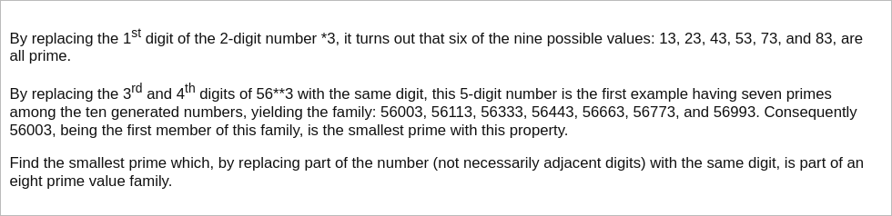

# [Project Euler Problem 51](https://projecteuler.net/problem=51)

## 问题

**Prime digit replacements**



## 答案

`121313`

## 解法

写程序暴力求解。
从小到大依次尝试不同位数中所有的质数，然后对每个质数穷举所有可能的模式，再检查每种模式是否达到`8`个。

算法部分的 Python 代码如下，完整的代码见 [solution_51.py](../solutions/solution_51.py)。

```python
import sympy


def enumerate_help(num: str, idx: int, ds: str, prefix: str, dp: dict) -> None:
    if idx == len(num):
        if '*' in prefix:
            if prefix not in dp:
                dp[prefix] = list()
            dp[prefix].append(num)
        return
    if num[idx] == ds:
        enumerate_help(num, idx + 1, ds, prefix + '*', dp)
    enumerate_help(num, idx + 1, ds, prefix + num[idx], dp)


def enumerate_patterns(num: str, dp: dict) -> None:
    # All masked indices must have the same digit.
    for ds in [str(x) for x in range(10)]:
        enumerate_help(num, 0, ds, '', dp)


def solve_p51(n: int) -> int:
    ll = 1
    while True:
        patterns = dict()
        for p in sympy.primerange(pow(10, ll - 1), pow(10, ll)):
            enumerate_patterns(str(p), patterns)
        result = None
        for k, v in patterns.items():
            if len(v) >= n:
                result = v[0] if result is None else min(result, v[0])
        if result is not None:
            return int(result)
        ll += 1
```

事实上，最终的模式是`*2*3*3`，对应的`8`个质数是`121313, 222323, 323333, 424343, 525353, 626363, 828383, 929393`。
