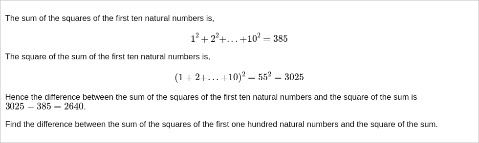

# [Project Euler Problem 6](https://projecteuler.net/problem=6)

## 问题

**Sum square difference**



## 答案

`25164150`

## 解法

前 `n` 个正整数的求和公式是 `n(n+1)/2`，平方和公式是 `n(n+1)(2n+1)/6`。
利用这两个公式直接写程序求解的 Python 代码如下，完整的代码见 [solution_6.py](../solutions/solution_6.py)。

```python
def solve_p6(n: int) -> int:
    linear_sum = n * (n + 1) // 2
    square_sum = n * (n + 1) * (2 * n + 1) // 6
    return linear_sum * linear_sum - square_sum
```
