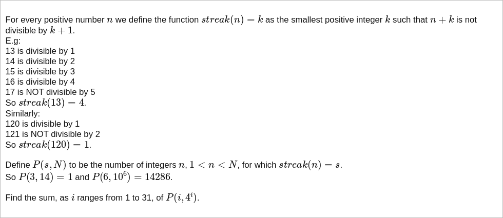

# [Project Euler Problem 601](https://projecteuler.net/problem=601)

## 问题

**Divisibility streaks**



## 答案

`1617243`

## 分析

对正整数 n 来说，令 `streak(n)=k`，那么根据定义，`(n+k)%(k+1) != 0` 成立，且有以下等式成立：

```text
n + 1 = 2 * a[1]
n + 2 = 3 * a[2]
...
n + (k - 1) = k * a[k-1]
```

其中 `a[i]` 表示一个正整数。

整理一下上面的等式，可以得到 `n-1 = 2(a[1]-1) = 3(a[2]-1) = ... = k(a[k-1]-1)`，也就是说 `n-1` 是 `1,2,...,k` 的公倍数，
但不是 `k+1` 的倍数。

根据定义，`P(s,N)` 是在 `1<n<N` 中满足 `streak(n)=s` 的正整数的个数。
我们可以首先计算出 `lcm(1,2,...,s)`，然后计算出 `1<n<N` 中是其倍数，但不是 `s+1` 的倍数的整数个数。

## 解法

算法部分的 Python 代码如下，完整的代码见 [solution_601.py](../solutions/solution_601.py)。

```python
def calc_p(s: int, n: int) -> int:
    lcm1 = math.lcm(*range(1, s + 1))
    cnt1 = (n - 1) // lcm1 - 1 // lcm1
    lcm2 = math.lcm(lcm1, s + 1)
    cnt2 = (n - 1) // lcm2 - 1 // lcm2
    return cnt1 - cnt2


def solve_p601():
    return sum([calc_p(i, 4 ** i) for i in range(1, 32)])
```

在上面的代码中，函数 `calc_p` 计算 `P(s,n)` 的值。
其中，`lcm1` 表示 `1,2,...,s` 的最小公倍数，`lcm2` 表示 `1,2,...,s,s+1` 的最小公倍数。
有了这两个最小共倍数之后，`cnt1` 表示 `1<m<n` 区间内 `1,2,...,s` 的公倍数的个数，
注意因为开区间的缘故， `m` 不能取下限 `1` ，所以需要减去 `1 // lcm1` 。
同理，`cnt2` 表示 `1<m<n` 区间内 `1,2,...,s,s+1` 的公倍数的个数。
两者相减即是 `P(s,n)` 的值。
