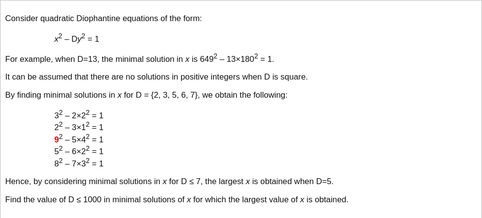

# [Project Euler Problem 66](https://projecteuler.net/problem=66)

## 问题

**Diophantine equation**



## 答案

`661`

## 分析

题目给出的方程形式是佩尔方程([Pell's equation](https://en.wikipedia.org/wiki/Pell%27s_equation))。

把`sqrt(D)`展开成连分数([Continued fraction](https://en.wikipedia.org/wiki/Continued_fraction))表示：`[a_0; a_1, a_2, a_3, ... ]`。
设`x_i/y_i`是的渐近分数列，由连分数理论知存在`i`使得`(x_i,y_i)`为佩尔方程的解。

## 解法

基于以上的分析，写程序求解。
算法部分的 Python 代码如下，这里使用了`sympy`包提供的连分数相关函数库。
完整的代码见 [solution_66.py](../solutions/solution_66.py)。

```python
import sympy
from sympy import continued_fraction_convergents, continued_fraction_iterator


def solve_pell(d: int) -> int:
    it = continued_fraction_convergents(continued_fraction_iterator(sympy.sqrt(d)))
    while True:
        r = next(it)
        if r.p * r.p - d * r.q * r.q == 1:
            return r.p


def solve_p66(max_d: int) -> int:
    result = 0
    best_x = 0
    for d in sympy.primerange(2, max_d + 1):
        x = solve_pell(d)
        if x > best_x:
            best_x = x
            result = d
    return result
```

具有最大的`x`的`D=661`，此时`x=16421658242965910275055840472270471049, y=638728478116949861246791167518480580`。
可以代入验证其满足`x^2 - D*y^2 = 1`。
