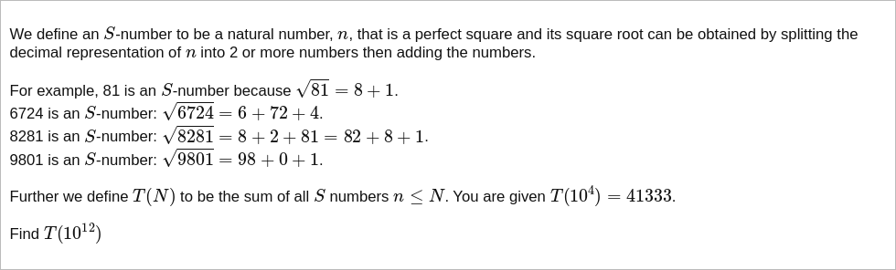

# [Project Euler Problem 719](https://projecteuler.net/problem=719)

## 问题

**Number Splitting**



## 答案

`128088830547982`

## 解法

因为所求的数字求平方根之后只有 `1,000,000`，所以可以暴力写程序求解。
一个优化是无论平方数如何拆分，它们数字和是相同的，即模除 `9` 的余数相同，可以利用这一点来剪枝。

算法部分的 Python 代码如下，完整的代码见 [solution_719.py](../solutions/solution_719.py)。

```python
from math import isqrt


def check_split_sum(expected_sum: int, square_str: str) -> bool:
    """Check if integer square_str (as a string) can be split into 2 or more parts added up to expected_sum.

    :param expected_sum: expected sum of parts.
    :param square_str: integer represented as a string.
    :return: True if it is able to find a split, False otherwise.
    """
    assert expected_sum >= 0
    if len(square_str) == 0:
        return expected_sum == 0
    for next_pos in range(1, 1 + len(square_str)):
        next_sum = expected_sum - int(square_str[:next_pos])
        if next_sum < 0:
            break
        if check_split_sum(next_sum, square_str[next_pos:]):
            return True
    return False


def solve_p719(n: int) -> int:
    max_sqrt = isqrt(n + 1)
    result = 0
    # Single digit numbers (sqrt(1)...sqrt(9)) cannot be split into two parts.
    for root in range(4, 1 + max_sqrt):
        square = root * root
        # Optimize for mod 9.
        if root % 9 != square % 9:
            continue
        # Check split sum recursively.
        if check_split_sum(root, str(square)):
            result += square
    return result
```
