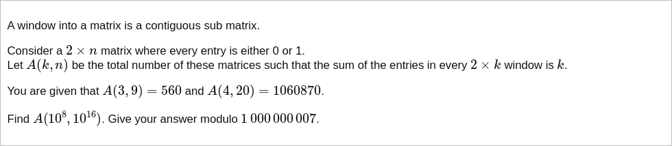

# [Project Euler Problem 743](https://projecteuler.net/problem=743)

## 问题

**Window into a Matrix**



## 答案

`259158998`

## 分析

设矩阵第`c`列的两个单元格中`1`的个数为`W(c)`，显然其取值只可能是`0,1,2`。
因为需要任意`2*k`长度的窗口中`1`的个数相同，所以必须有`W(m)=W(m+k)`对任意`m`成立，即窗口内容是以`k`为长度进行循环的。
注意到题目给出的几个例子和最终问题的`A(k,n)`中，矩阵列数`n`都是窗口长度`k`的倍数，即整个矩阵可以被完整的窗口循环覆盖。
因此只需要考虑单个窗口内部的情况然后再计算整个矩阵的相关数值。

令`x,y,z`分别是某个长度为`k`的窗口中`W(c)`的值等于`0,1,2`的列数，其中`c=1,2,...,k`。
那么根据窗口大小限制，有：`x+y+z=k`。
另一方面，根据题目要求的`1`的个数加和限制，有`y+2*z=k`。
因此，只需要循环一个数字(例如`y`)，就可以穷举`x,y,z`的所有可能性。

给定`x,y,z`后，具体`W(c)`的排列的可能性是扩展的组合数`C(k;x,y,z)=k! / (x! y! z!)`。
这个数值在循环的过程中可以迭代计算，递归公式为：`C(k;x,y,z)=C(k;x+1,y-2,z) * (x+1)*(z+1)/((y-1)*y)`。
其中除法需要运用费马小定理转为模除求逆。

对于某一列`c`来说，当两个单元格全为`0`或者全为`1`时，只有一种情况，而当`W(c)=1`时，有`01,10`两种情况可选。
因此，在给定`y`时，最终的数值需要乘以`pow(2,y*n/k)`。

## 解法

根据以上的分析，可以写程序求解。算法部分的 Python 代码如下，完整的代码见 [solution_743.py](../solutions/solution_743.py)。

```python

def solve_p743(k: int, n: int, mod: int) -> int:
    assert n % k == 0
    result = 0
    # Initialize: x=z=k//2, y=k%2.
    c = multinomial_mod_prime(k, [k // 2, k % 2, k // 2], mod)
    result = (result + c * pow(2, k % 2 * n // k, mod)) % mod
    # Iterative.
    for y in range(k % 2 + 2, k + 1, 2):
        x = z = (k - y) // 2
        # Calculate `c = k! / (x! y! z!)` incrementally.
        # C(k;x,y,z)=k!/(x! y! z!)= (x+1)*(z+1)/((y-1)*y) * C(k;x+1,y-2,z+1).
        # We have to cancel out powers of mod before calculate the modulo inverse.
        a = (x + 1) * (z + 1)
        b = y * (y - 1)
        while a % mod == 0 and b % mod == 0:
            a //= mod
            b //= mod
        c = c * a * mod_prime_inv(b, mod) % mod
        result = (result + c * pow(2, y * n // k, mod)) % mod
    return result
```
