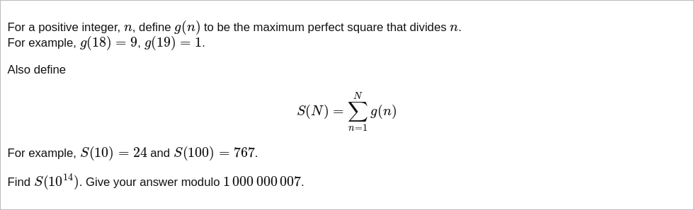

# [Project Euler Problem 745](https://projecteuler.net/problem=745)

## 问题

**Sum of Squares II**



## 答案

`94586478`

## 解法

因为最终要求的`N=10^14`比较大，不能直接存长度为`N`的数组，而`sqrt(N)=10^7`是可以存下来的用于动态规划。

以`k*k`为**平方因子**并且小于`N`的正整数的个数可以直接计算`N//(k*k)`得到，其中`1<=k*k<=N`。
但如果是以`k*k`为**最大平方因子**并且小于`N`的正整数的个数，则需要减去所有的以`m*m`为**平方因子**并且小于`N`的正整数的个数，
其中`m>k`且`m%k==0`。

因此，我们可以用类似筛法求质数的方法来求解本题。
注意计算过程中随时要模除。

- 令数组`c[k]`记录`k*k`为**最大平方因子**并且小于`N`的正整数的个数，其中`1<=k*k<=N`。
- 从大到小循环`k`，每次循环可以计算`c[k]`的值等于`N//(k*k) - c[2*k] - c[3*k] ...`。
- 一个小的优化：因为当`k`比较大时，`c[k]`的值都是`1`，因此可以记住最后一个不为`1`的下标，优化上述的计算。

算法部分的 Python 代码如下，完整的代码见 [solution_745.py](../solutions/solution_745.py)。

```python
import math


def solve_p745(n: int) -> int:
    mod = 1000000007
    max_k = math.isqrt(n)
    # Array c[k] is the number of integers with `k*k` as the max perfect square factor.
    c = [0] * (1 + max_k)
    # Last index of a non-one value.
    last_index = -1
    for k in range(max_k, 0, -1):
        c[k] = n // (k * k) % mod
        i = 2
        while k * i <= max_k:
            # Small optimization.
            if 0 < last_index < k * i:
                c[k] = (c[k] + mod - (max_k//k - i + 1)) % mod
                break
            c[k] = (c[k] + mod - c[k * i]) % mod
            i += 1
        if last_index < 0 and c[k] != 1:
            last_index = k
    # Calculate result.
    result = 0
    for i in range(1, len(c)):
        result = (result + c[i] * i * i) % mod
    return result
```
