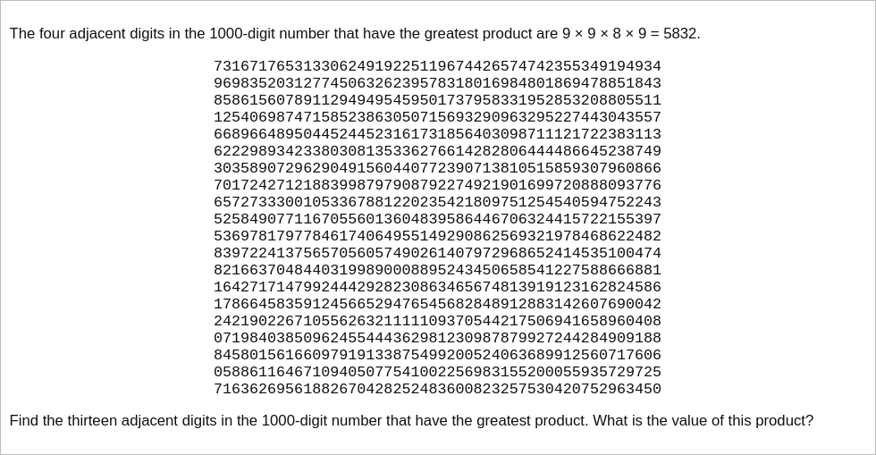

# [Project Euler Problem 8](https://projecteuler.net/problem=8)

## 问题

**Largest Product in a Series**



## 答案

`23514624000`

## 解法 1

直接写程序暴力搜索。

算法部分的 Python 代码如下，完整的代码见 [solution_8.py](../solutions/solution_8.py)。

```python
def solve_p8_naive(n: str, k: int):
    result = 0
    for s in range(0, len(n) - k + 1):
        prod = 1
        for l in range(1, k + 1):
            prod *= int(n[s + l - 1:s + l])
        result = max(result, prod)
    return result
```

## 解法 2

如果 0 出现在乘积中，那么结果一定为 0 。
基于此，可以把原来的字符串拆分成若干个用 0 分隔的子串，然后穷举。

算法部分的 Python 代码如下，完整的代码见 [solution_8.py](../solutions/solution_8.py)。

```python
def solve_p8(n: str, k: int):
    result = 0
    for item in n.split('0'):
        result = max(result, solve_p8_naive(item, k))
    return result
```
