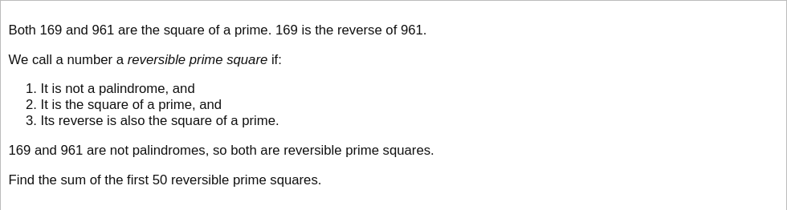

# [Project Euler Problem 808](https://projecteuler.net/problem=808)

## 问题

**Reversible prime squares**



## 答案

`3807504276997394`

## 解法

直接从小到大暴力搜索所有的质数，计算其平方，并判断平方的数字顺序逆序之后是不是另一个质数的平方数。
算法部分的 Python 代码如下，完整的代码见 [solution_808.py](../solutions/solution_808.py)。

```python
import math

import sympy
from sortedcontainers import SortedSet


def solve_p808(cnt: int) -> int:
    ll = 0
    results = SortedSet()
    while len(results) < cnt:
        ll += 1
        for prime in sympy.sieve.primerange(pow(10, ll - 1), pow(10, ll)):
            sq = prime * prime
            if sympy.ntheory.is_palindromic(sq):
                continue
            # Reverse integer.
            sqr = int(str(sq)[::-1])
            sr = math.isqrt(sqr)
            if sr * sr != sqr:
                continue
            if sympy.isprime(sr):
                results.add(sq)
                results.add(sqr)
    return sum(results[:cnt])
```

实际上，前五十个符合条件的数是：
```text
169
961
12769
96721
1042441
1062961
1216609
1442401
1692601
9066121
121066009
900660121
12148668841
12367886521
12568876321
14886684121
1000422044521
1002007006009
1020506060401
1040606050201
1210684296721
1212427816609
1212665666521
1214648656321
1234367662441
1236568464121
1254402240001
1256665662121
1276924860121
1442667634321
9006007002001
9066187242121
100042424498641
100222143232201
100240164024001
100402824854641
100420461042001
102012282612769
102014060240401
102232341222001
104042060410201
121002486012769
121264386264121
121462683462121
123212686214641
146412686212321
146458428204001
146894424240001
967210684200121
967216282210201
```
