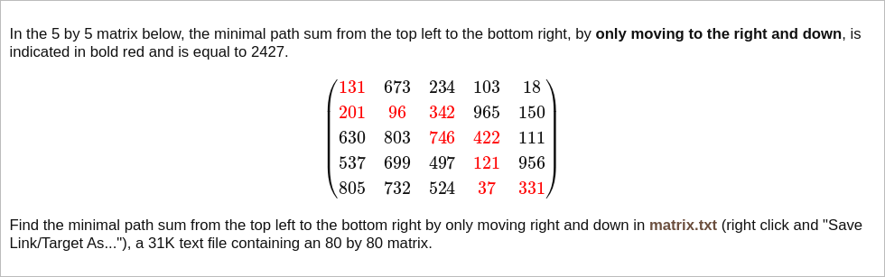

# [Project Euler Problem 81](https://projecteuler.net/problem=81)

## 问题

**Path sum: two ways**



## 答案

`427337`

## 解法

标准的动态规划题目。

令`dp(i,j)`是从左上角出发到`(i,j)`位置的代价最小的路径的代价。
递推公式：`dp(i,j)=max(matrix(i,j)+dp(i-1,j), matrix(i,j)+dp(i,j-1))`。

算法部分的 Python 代码如下，完整的代码见 [solution_81.py](../solutions/solution_81.py)。

```python
def min_path_sum(mat: list[list[int]]) -> int:
    rows = len(mat)
    cols = len(mat[0])
    # First row.
    dp = [0] * cols
    dp[0] = mat[0][0]
    for c in range(1, cols):
        dp[c] = dp[c - 1] + mat[0][c]
    # Other rows.
    for r in range(1, rows):
        ndp = [dp[0] + mat[r][0]]
        for c in range(1, cols):
            ndp.append(mat[r][c] + min(ndp[-1], dp[c]))
        dp, ndp = ndp, dp
    return dp[-1]
```
