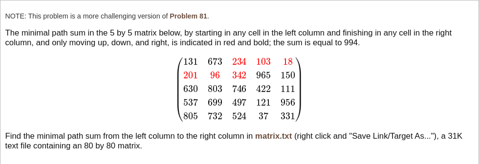

# [Project Euler Problem 82](https://projecteuler.net/problem=82)

## 问题

**Path sum: three ways**



## 答案

`260324`

## 解法

令`dp(i,j)`记住的是从最左列某个位置到位置`(i,j)`的路径的最小代价。
从左往右按列搜索，每次计算从上一列的第`k`行移动到当前位置的最小代价，并和已经算过的最小代价进行比较，记录下较小的值。

算法部分的 Python 代码如下，完整的代码见 [solution_82.py](../solutions/solution_82.py)。

```python
def min_path_sum(mat: list[list[int]]) -> int:
    rows = len(mat)
    cols = len(mat[0])
    # Loop over columns.
    dp = [0] * rows
    for c in range(cols):
        ndp = [-1] * rows
        # Starting from row r in previous column.
        for r in range(rows):
            # Move up.
            up_cost = dp[r]
            for nr in range(r, -1, -1):
                up_cost += mat[nr][c]
                if ndp[nr] < 0 or up_cost < ndp[nr]:
                    ndp[nr] = up_cost
            # Move down.
            down_cost = dp[r]
            for nr in range(r, rows):
                down_cost += mat[nr][c]
                if ndp[nr] < 0 or down_cost < ndp[nr]:
                    ndp[nr] = down_cost
        # Swap.
        dp, ndp = ndp, dp
    return min(dp)
```
