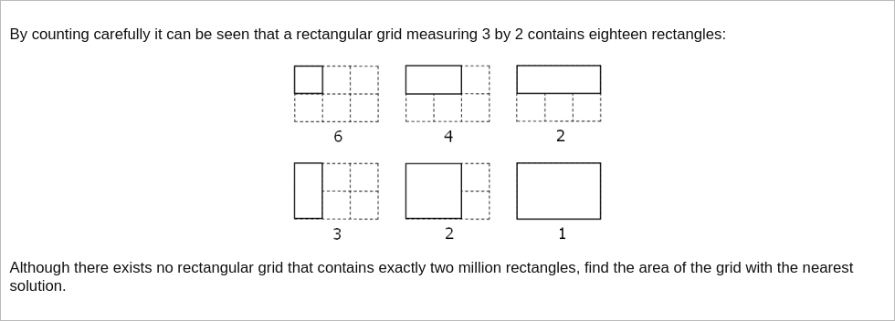

# [Project Euler Problem 85](https://projecteuler.net/problem=85)

## 问题

**Counting rectangles**



## 答案

`2772`

## 解法

对于长宽分别是`m,n`的矩形来说(`m>=n`)，包含的小矩形的一条边可以取`m(m+1)/2`个值，另一条边可以取`n(n+1)/2`个值，
所以总共的矩形有`m(m+1)n(n+1)/4`个。

大致估算一下长的上限：假设`n=1`，代入`m(m+1)n(n+1)/4=2000000`，求解出`m`约为`2000`。
这个上限不是特别大，因此可以暴力穷举所有的上限内的`m,n`，计算最接近给定总矩形数的大矩形的长和宽。

算法部分的 Python 代码如下，完整的代码见 [solution_85.py](../solutions/solution_85.py)。

```python
def count_rectangles(m: int, n: int) -> int:
    return m * (m + 1) * n * (n + 1) // 4


def solve_p85(rectangle_count: int) -> int:
    n = 1
    best_diff = -1
    best_m = 1
    best_n = 1
    while True:
        m = n
        while True:
            cnt = count_rectangles(m, n)
            diff = abs(cnt - rectangle_count)
            if best_diff < 0 or diff < best_diff:
                best_diff = diff
                best_m = m
                best_n = n
            if cnt > rectangle_count:
                break
            m += 1
        if count_rectangles(n, n) > rectangle_count:
            break
        n += 1
    return best_m * best_n
```

事实上，最终结果的矩形大小为`77x36`，小矩形的总数是`1999998`
