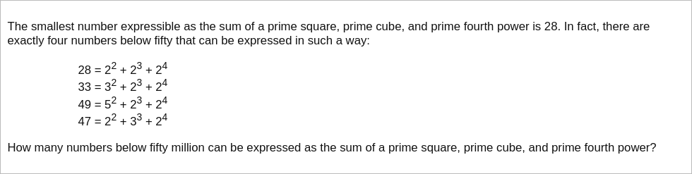

# [Project Euler Problem 87](https://projecteuler.net/problem=87)

## 问题

**Prime power triples**



## 答案

`1097343`

## 解法

直接写程序暴力求解。
小于`50000000`的数字开二次方、开三次方、开四次方分别是`7071.1,368.4,84.1`，可以循环符合条件的所有质数，记录下有多少个数字符合条件。

算法部分的 Python 代码如下，完整的代码见 [solution_87.py](../solutions/solution_87.py)。

```python
import math
import sympy


def solve_p87(n: int) -> int:
    primes = list(sympy.primerange(1, int(math.isqrt(n)) + 1))
    valid = set()
    for p4 in primes:
        power4 = pow(p4, 4)
        if power4 >= n:
            break
        for p3 in primes:
            power3 = pow(p3, 3)
            if power4 + power3 >= n:
                break
            for p2 in primes:
                power2 = pow(p2, 2)
                if power4 + power3 + power2 >= n:
                    break
                valid.add(power4 + power3 + power2)
    return len(valid)
```
