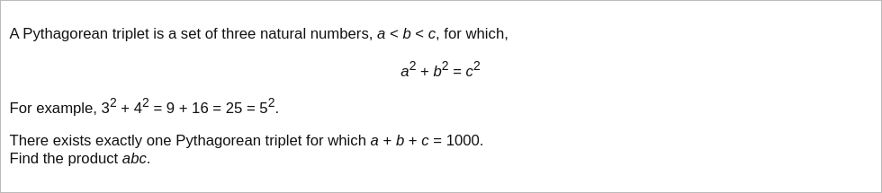

# [Project Euler Problem 9](https://projecteuler.net/problem=9)

## 问题

**Special Pythagorean Triplet**



## 答案

`31875000`

## 解法 1

直接写程序暴力搜索，算法部分的 Python 代码如下，完整的代码见 [solution_9.py](../solutions/solution_9.py)。

```python
def solve_p9(n: int) -> int:
    for a in range(1, n + 1):
        for b in range(a + 1, n + 1):
            c = n - a - b
            if a * a + b * b == c * c:
                return a * b * c
    return -1
```

事实上，找到一组解是：`(200,375,425)`。

## 解法 2

根据[欧几里德公式](https://en.wikipedia.org/wiki/Pythagorean_triple#Generating_a_triple)，
满足勾股定理`a*a+b*b=c*c`的三个正整数可以写成：
`a=m*m-n*n, b=2*m*n, c=m*m+n*n`，其中`m>n>0`。

代入`a+b+c=1000`并化简，得到`m(m+n)=500`。

根据条件`m>n>0`，可以求出唯一可能的`m=20,n=5`，因此`a=375,b=200,c=425`。
