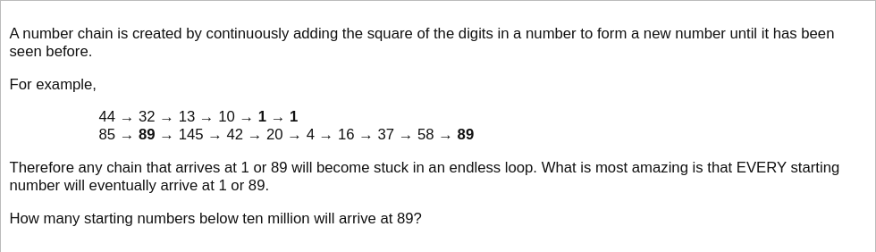

# [Project Euler Problem 92](https://projecteuler.net/problem=92)

## 问题

**Square digit chains**



## 答案

`8581146`

## 解法

显然在小于`10000000`的数字中，数码(digit)平方和最大的数字是`9999999`，它的数码平方和是`567`。
另一方面，对于任意一个三位数来说，数码平方和最大的数对应的是`999`的数码平方和等于`243`，小于`567`。
因此只需要记住`1~567`这些数字是否最终会落到`89`即可。

算法部分的 Python 代码如下，完整的代码见 [solution_92.py](../solutions/solution_92.py)。

```python
def sum_digit_squares(n: int) -> int:
    result = 0
    while n > 0:
        result += (n % 10) * (n % 10)
        n //= 10
    return result


def solve_p92() -> int:
    max_number = pow(10, 7) - 1
    dp = dict()
    # Prepare cached array.
    for i in range(1, sum_digit_squares(max_number) + 1):
        seen = set()
        k = i
        while k not in seen and k not in dp:
            seen.add(k)
            k = sum_digit_squares(k)
        reached = dp.get(k) if k in dp else 89 in seen
        for m in seen:
            dp[m] = reached
    # Loop over all numbers.
    result = 0
    for i in range(1, max_number + 1):
        if i in dp:
            if dp[i]:
                result += 1
        else:
            if dp[sum_digit_squares(i)]:
                result += 1
    return result
```
