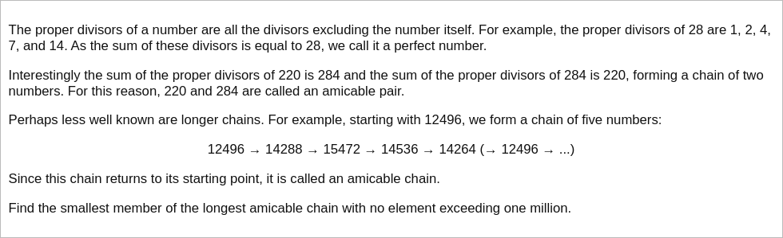

# [Project Euler Problem 95](https://projecteuler.net/problem=95)

## 问题

**Amicable chains**



## 答案

`14316`

## 解法

使用筛法预先计算并记录每个整数的真因子之和，然后搜索所有的亲和数链(Amicable chains)，找到最长的一条链返回长度。

一点需要注意的是，需要检查环是否回到起点，例如：对于`25 -> 6 -> 6`这个环来说，不能把从`25`开始的环的长度记为`2`。

写程序求解，算法部分的 Python 代码如下，完整的代码见 [solution_95.py](../solutions/solution_95.py)。

```python
def proper_divisors_sum(n: int) -> list[int]:
    result = [0, 0] + [1] * (n - 1)
    for p in range(2, n + 1):
        for q in range(p + p, n + 1, p):
            result[q] += p
    return result


def calc_loops(dp: list[int], n: int) -> list[int]:
    result = [-1] * (n + 1)
    for i in range(2, n + 1):
        if result[i] >= 0:
            continue
        nums = dict()
        k = i
        while True:
            if k == 0 or k > n or result[k] >= 0:
                loop_size = 0
                break
            if k in nums:
                loop_size = len(nums) - nums[k]
                break
            nums[k] = len(nums)
            k = dp[k]
        # Set loop size for seen numbers.
        for i in nums:
            result[i] = loop_size if nums[i] >= len(nums) - loop_size else 0
    return result


def solve_p95(n: int) -> int:
    dp = proper_divisors_sum(n)
    loops = calc_loops(dp, n)
    idx = 0
    for i in range(len(loops)):
        if loops[i] > loops[idx]:
            idx = i
    return idx
```

事实上，最终得到的长度为`28`的亲和数链是：
`14316->19116->31704->47616->83328->177792->295488->629072->589786->294896->358336->418904->366556->274924->275444->243760->376736->381028->285778->152990->122410->97946->48976->45946->22976->22744->19916->17716`。
