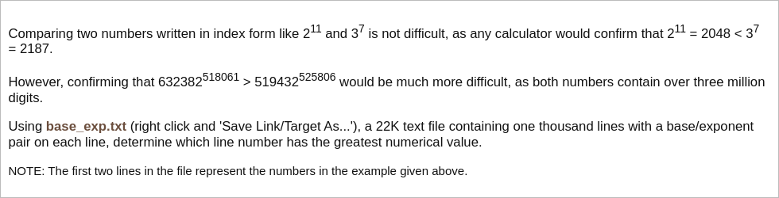

# [Project Euler Problem 99](https://projecteuler.net/problem=99)

## 问题

**Largest exponential**



数据文件：[p099_base_exp.txt](../resources/p099_base_exp.txt)

## 答案

`709`

## 解法

因为数值太大，直接求解`a^e`不可行，但可以取对数，比较`e * log(a)`的值。

算法部分的 Python 代码如下，完整的代码见 [solution_99.py](../solutions/solution_99.py)。

```python
import math


def solve_p99(file_name: str) -> int:
    with open(file_name, 'r') as fp:
        line_num = 0
        best_line_num = 1
        best_value = 0.0
        for line in fp.readlines():
            a, e = (int(x) for x in line.strip().split(','))
            line_num += 1
            curr = e * math.log(a)
            if curr > best_value:
                best_value = curr
                best_line_num = line_num
    return best_line_num
```
